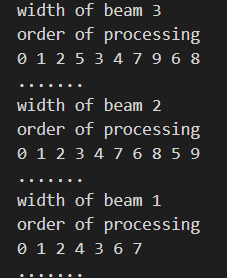
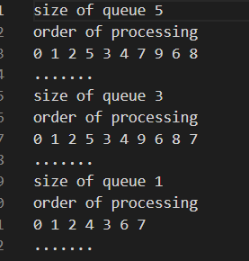
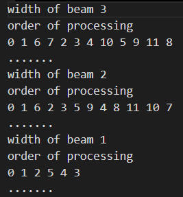
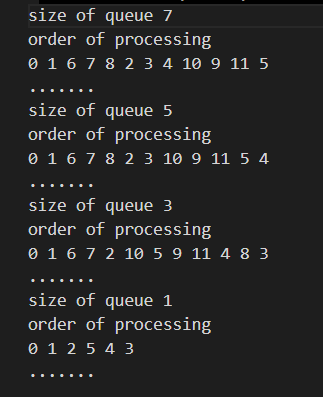

# this is beam search implementation by Shivansh Singla UE203109 cse 2

## here the size of queue and graph are already inputted code is ready to run
<pre>
graph1 = {{0, 1, 1, 0, 0, 1, 0, 0, 0, 0}, 
        {1, 0, 1, 1, 0, 0, 0, 0, 0, 0}, 
        {1, 1, 0, 0, 1, 0, 0, 1, 0, 0}, 
        {0, 1, 0, 0, 1, 0, 1, 0, 1, 0}, 
        {0, 0, 1, 1, 0, 1, 1, 0, 0, 0}, 
        {1, 0, 0, 0, 1, 0, 0, 0, 0, 1}, 
        {0, 0, 0, 1, 1, 0, 0, 1, 0, 0}, 
        {0, 0, 1, 0, 0, 0, 1, 0, 0, 0}, 
        {0, 0, 0, 1, 0, 0, 0, 0, 0, 1}, 
        {0, 0, 0, 0, 0, 1, 0, 0, 1, 0}};
graph2 = [[0, 1, 0, 0, 0, 0, 1, 1, 1, 0, 0, 0], 
[1, 0, 1, 1, 1, 0, 0, 0, 0, 0, 0, 0], 
[0, 1, 0, 0, 0, 1, 0, 0, 0, 1, 0, 0], 
[0, 1, 0, 0, 1, 0, 0, 0, 0, 0, 0, 0], 
[0, 1, 0, 1, 0, 1, 0, 0, 0, 0, 0, 0], 
[0, 0, 1, 0, 1, 0, 0, 0, 0, 0, 0, 0], 
[1, 0, 0, 0, 0, 0, 0, 0, 0, 0, 0, 0], 
[1, 0, 0, 0, 0, 0, 0, 0, 0, 0, 1, 0], 
[1, 0, 0, 0, 0, 0, 0, 0, 0, 1, 0, 1], 
[0, 0, 1, 0, 0, 0, 0, 0, 1, 0, 0, 0], 
[0, 0, 0, 0, 0, 0, 0, 1, 0, 0, 0, 1], 
[0, 0, 0, 0, 0, 0, 0, 0, 1, 0, 1, 0]]
</pre>
<table border="3" align="center">
  <tr>
    <th>graph1_beam_search_with_fixed_width</th>
    <th>graph1_beam_search_with_fixed_queue</th>
    <th>graph2_beam_search_with_fixed_width</th>
    <th>graph2_beam_search_with_fixed_queue</th>
  </tr>
  <tr>
       <th>
       <th>
       <th>
       <th>
  </tr>     
</table>
