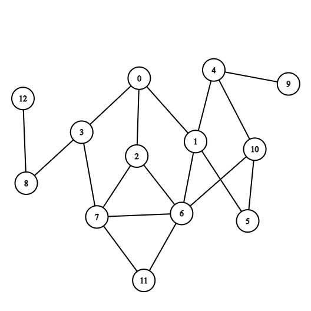

## the programs are interactive only input they require are num of nodes,num of edges and list of edges

## note - nodes are 0 based

### Input data
<pre>
13 18
0 1
0 2
0 3
1 4
1 5
1 6
2 6
2 7
3 7
3 8
6 7
4 9
4 10
5 10
6 10
6 11
7 11
8 12
</pre>
### graph visualized
note - this is the same as given in class  
note - used cs academy graph editor for making this

## output of iterative_deepening_search
<pre>
depth of search here is
1
order of processing here is
0 
..........
depth of search here is
2
order of processing here is
0 1 2 3 
..........
depth of search here is
3
order of processing here is
0 1 4 5 6 2 7 3 8 
..........
</pre>

## Output of Iterative_Deepening_search_with_beam_of_widths_1,2,3
<pre>
depth of search and width here is
1 1
order of processing here is
0 
..........
depth of search and width here is
2 1
order of processing here is
0 1 
..........
depth of search and width here is
3 1
order of processing here is
0 1 4 
..........
depth of search and width here is
1 2
order of processing here is
0 
..........
depth of search and width here is
2 2
order of processing here is
0 1 2 
..........
depth of search and width here is
3 2
order of processing here is
0 1 4 5 2 6 7 
..........
depth of search and width here is
1 3
order of processing here is
0 
..........
depth of search and width here is
2 3
order of processing here is
0 1 2 3 
..........
depth of search and width here is
3 3
order of processing here is
0 1 4 5 6 2 7 3 8 
..........
</pre>

## Output of Iterative_Deepening_search_with_beam_of_width_depth_at_each_iteration
<pre>
depth of search and width here are same and equal to
1
order of processing here is
0 
..........
depth of search and width here are same and equal to
2
order of processing here is
0 1 
..........
depth of search and width here are same and equal to
3
order of processing here is
0 1 4 5 2 6 7 
..........
</pre>
