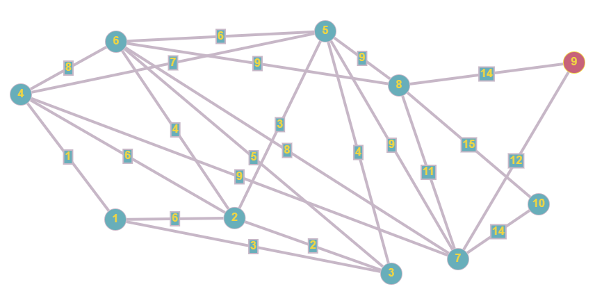

<pre>
Shivansh Singla
UE203109
CSE 2
</pre>

### note - for easier implementation A,B,...,J -> 1,2,...,10

## The graph with weights used for input is

## heuristic values

![alt text][Agraph.jpg "the heuristic values"]
