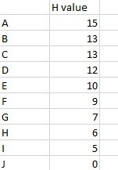

<pre>
Shivansh Singla
UE203109
CSE 2
</pre>

### note - for easier implementation A,B,...,J -> 1,2,...,10

## The graph with weights used for input is


## heuristic values



## my code also has interactive version which i have commented out

#### hardcoded graph and heuristics with conversion process to adj list

```
vector<vector<int>> graph ={{0, 6, 3, 1, 0, 0, 0, 0, 0, 0}, 
        {6, 0, 2, 6, 3, 4, 0, 0, 0, 0}, 
        {3, 2, 0, 0, 4, 5, 0, 0, 0, 0}, 
        {1, 6, 0, 0, 7, 8, 9, 0, 0, 0}, 
        {0, 3, 4, 7, 0, 6, 9, 9, 0, 0}, 
        {0, 4, 5, 8, 6, 0, 8, 9, 0, 0}, 
        {0, 0, 0, 9, 9, 8, 0, 11, 12, 14}, 
        {0, 0, 0, 0, 9, 9, 11, 0, 14, 15}, 
        {0, 0, 0, 0, 0, 0, 12, 14, 0, 0}, 
        {0, 0, 0, 0, 0, 0, 14, 15, 0, 0}};
        
    adj = vector<vector<pii>> (graph.size() + 1);
    for(int i=0;i<graph.size();i++)
    {
        for(int j=0;j<graph.size();j++)
        {
            if(graph[i][j] == 0){continue;}
            adj[i+1].push_back( {j+1,graph[i][j]} );
        }
    }
    h = {{1,15},{2,13},{3,13},{4,12},{5,10},{6,9},{7,7},{8,6},{9,5},{10,0}};
```

### output of hard coded code

<pre>
path found
10<-7<-4<-1
</pre>

## this output is equivalent to

J <- G <- D <- A
